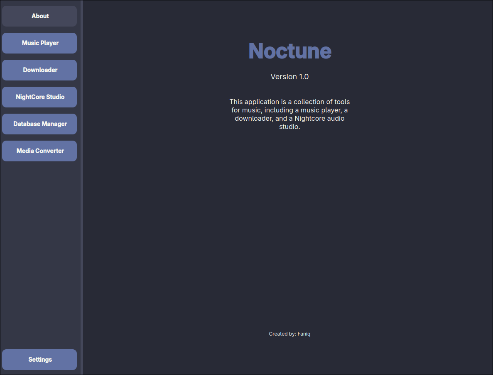
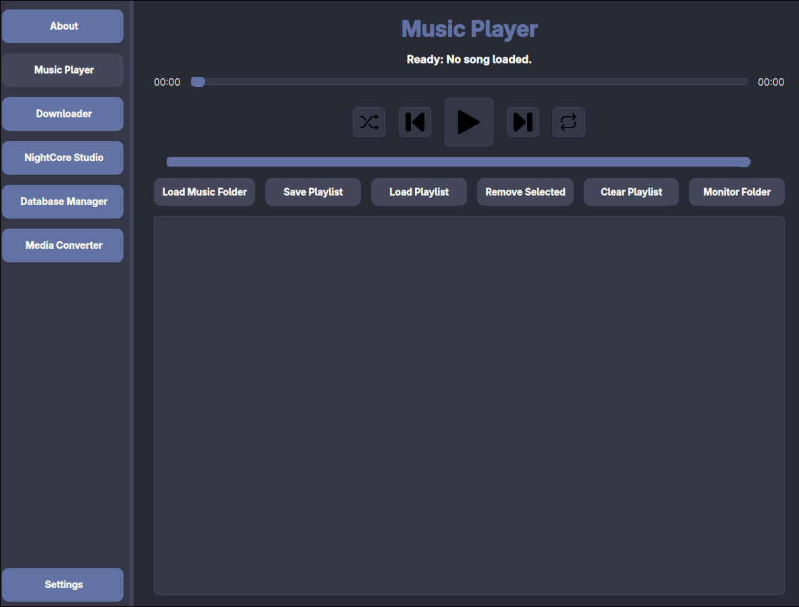
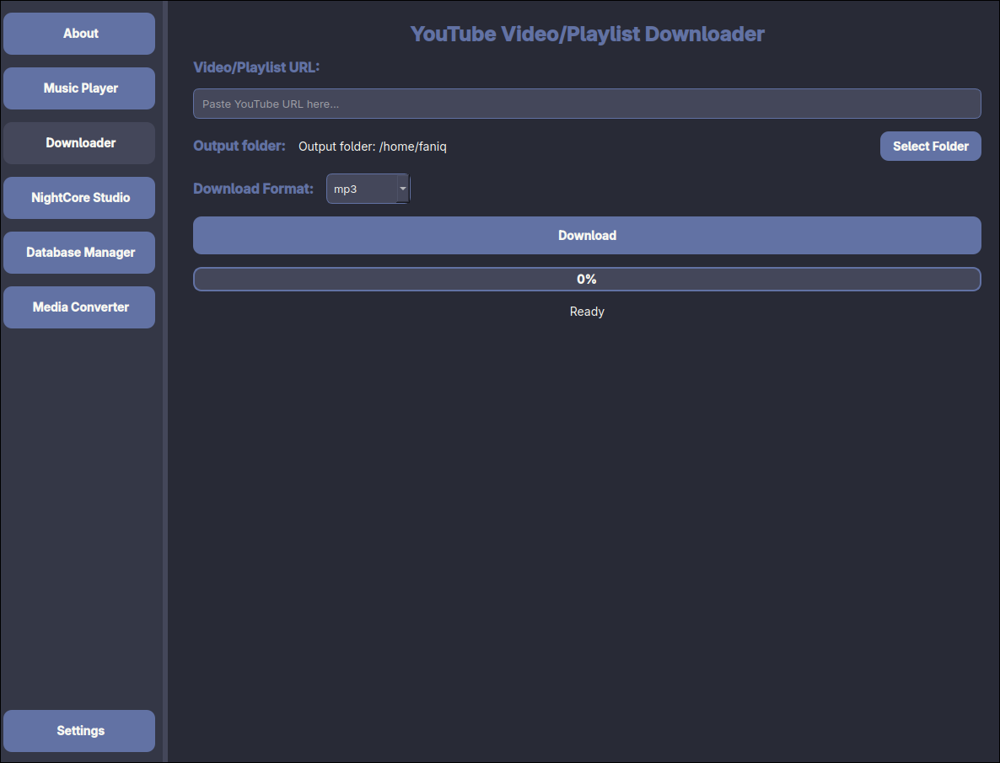
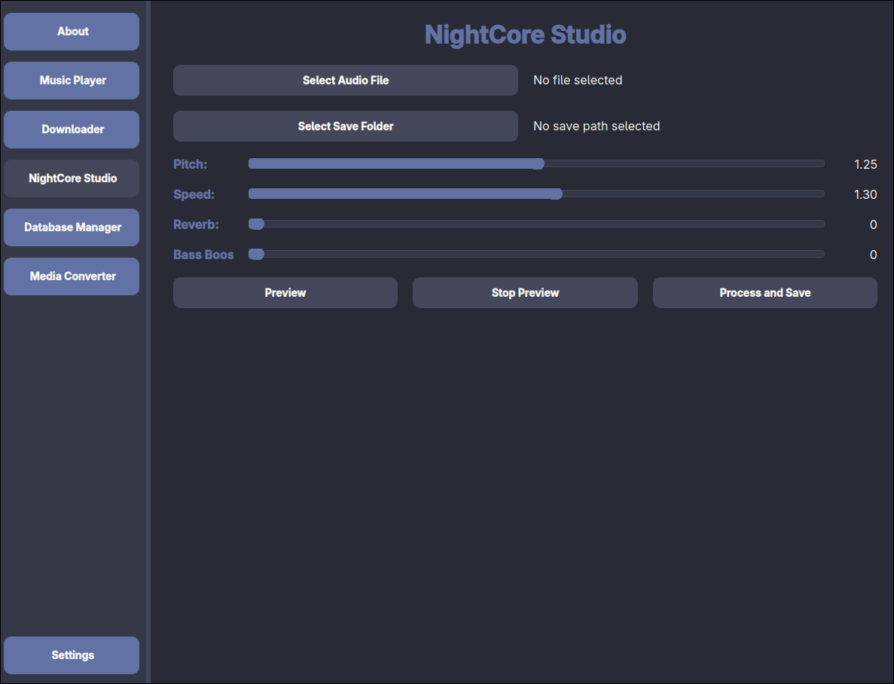
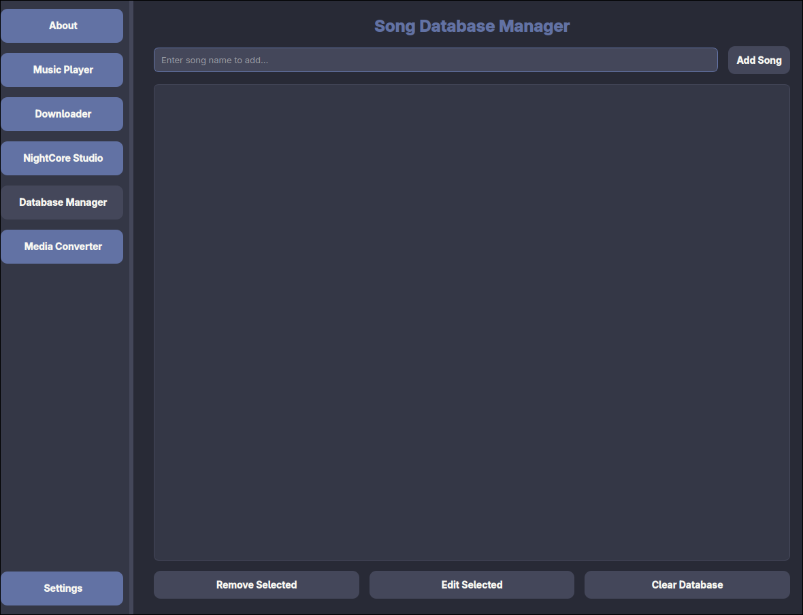
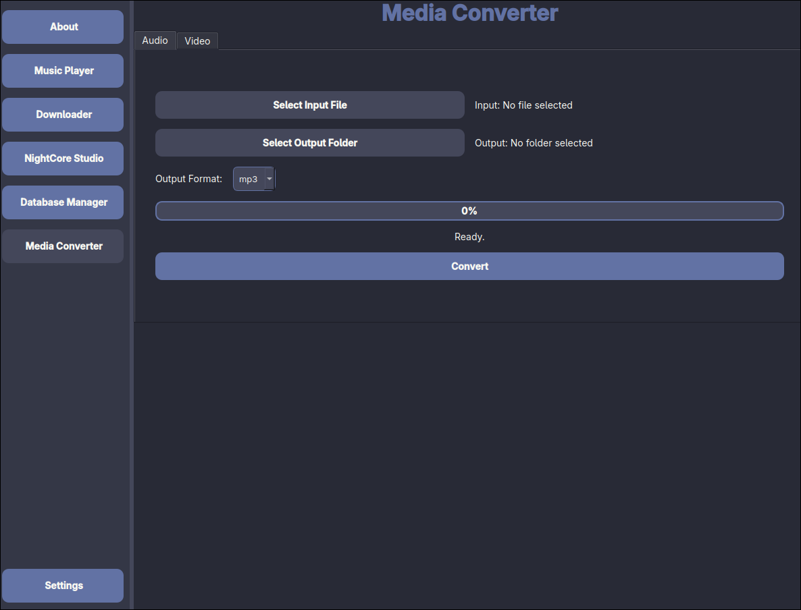

# 🎧 Noctune - Multimedia Toolkit

**Noctune** is a sleek, all-in-one multimedia desktop application built with Python and PySide6. It combines essential tools for music lovers, Nightcore creators, DJs, and anyone working with audio and video.

---

## ✨ Features

| Tool               | Description                                                                 |
|--------------------|-----------------------------------------------------------------------------|
| 🎵 Music Player     | A simple audio player with playlist support, timeline, and volume control  |
| 📥 Downloader       | Download videos or full playlists from YouTube in various formats          |
| 🎶 Nightcore Studio | Create Nightcore remixes by adjusting pitch, tempo, and applying effects   |
| 📚 Database Manager | Manage a local database of songs and downloaded media                      |
| 🔁 Media Converter  | Convert audio/video files between formats like MP3, WAV, FLAC, MP4, etc.   |
| ⚙️ Settings         | Switch between UI themes and customize your experience                    |

---

## 🖼️ Screenshots

Here are some screenshots showcasing the application interface:

|  |  |  |
|-----------------------------------|-----------------------------------|-----------------------------------|
| Main Window                      | Downloader                        | Music Player                     |

|  |  |  |
|------------------------------------|------------------------------------|------------------------------------|
| Nightcore Studio                   | Media Converter                   | Settings                         |

*Note:* Make sure to add the `screenshots` folder with images named `1.png` through `6.png` in the root of your repository.

---

## 🛠️ Requirements

- Python 3.9+
- [ffmpeg](https://ffmpeg.org/) (must be installed and in PATH)
- `yt-dlp`
- PySide6

Install dependencies:

```bash
pip install -r requirements.txt
